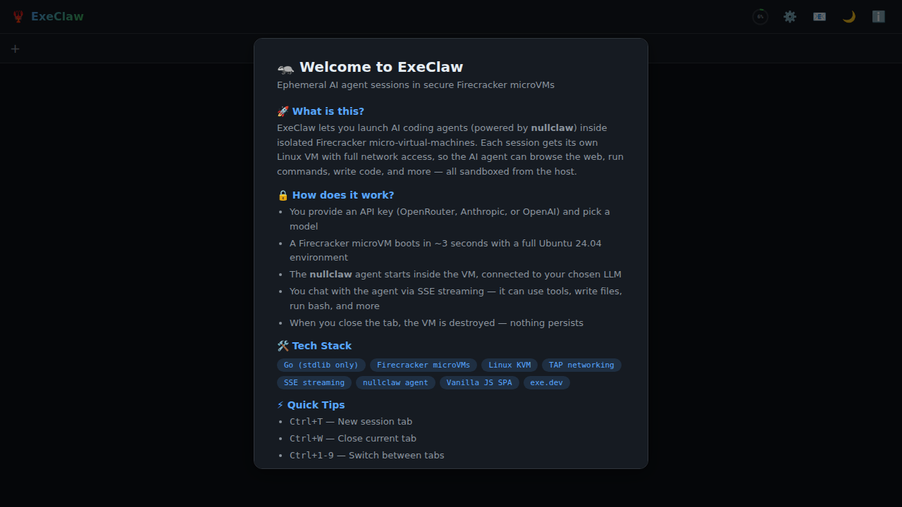
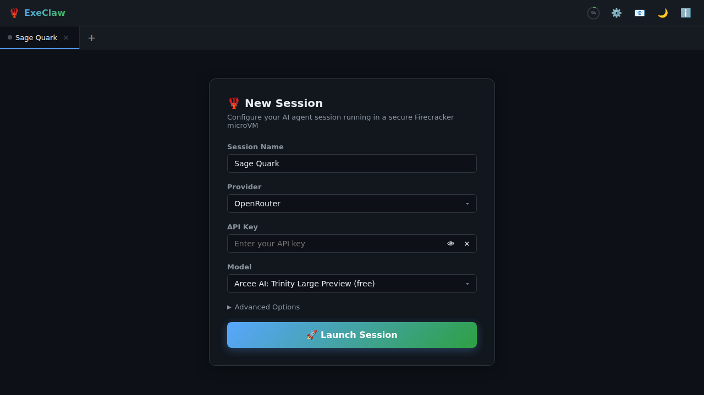
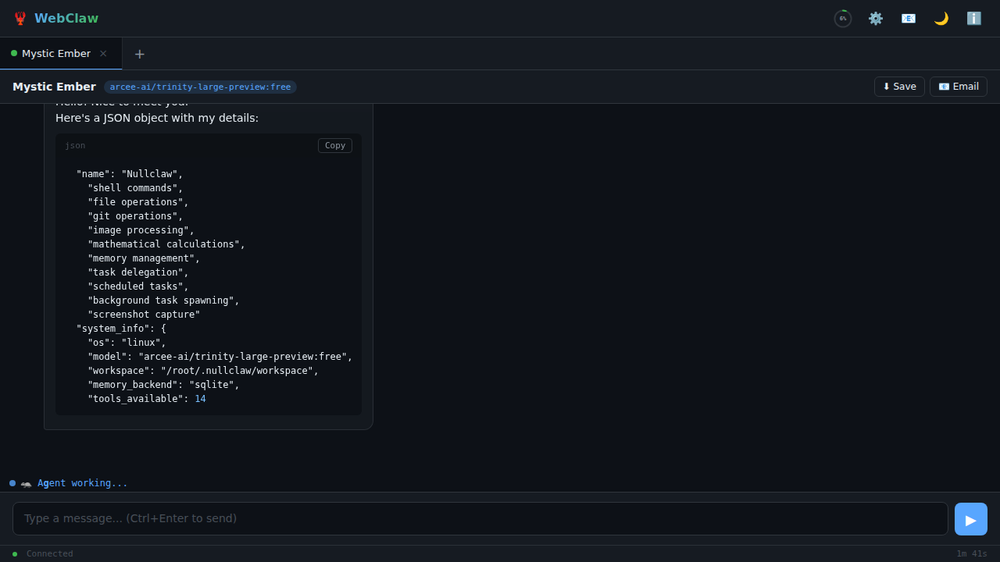
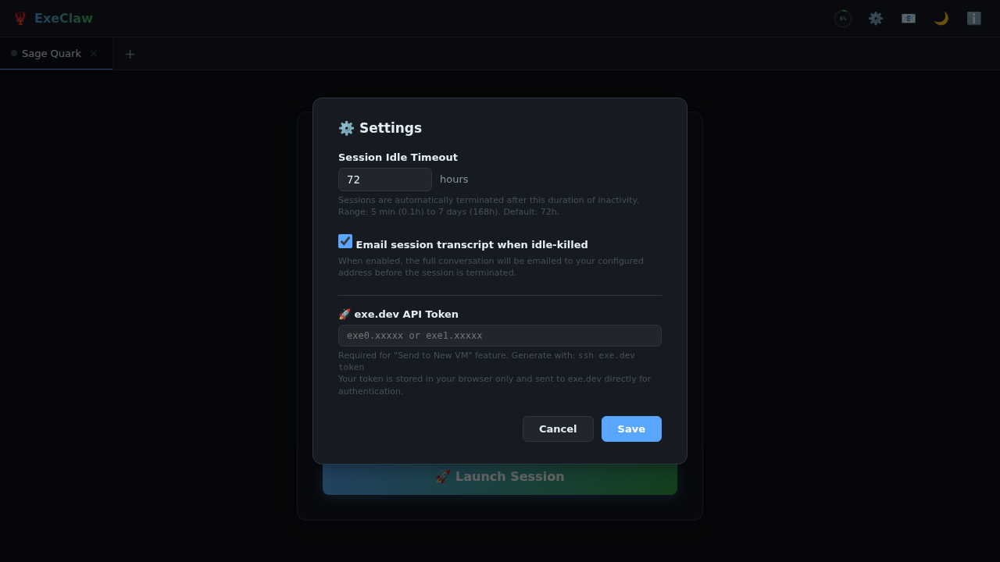
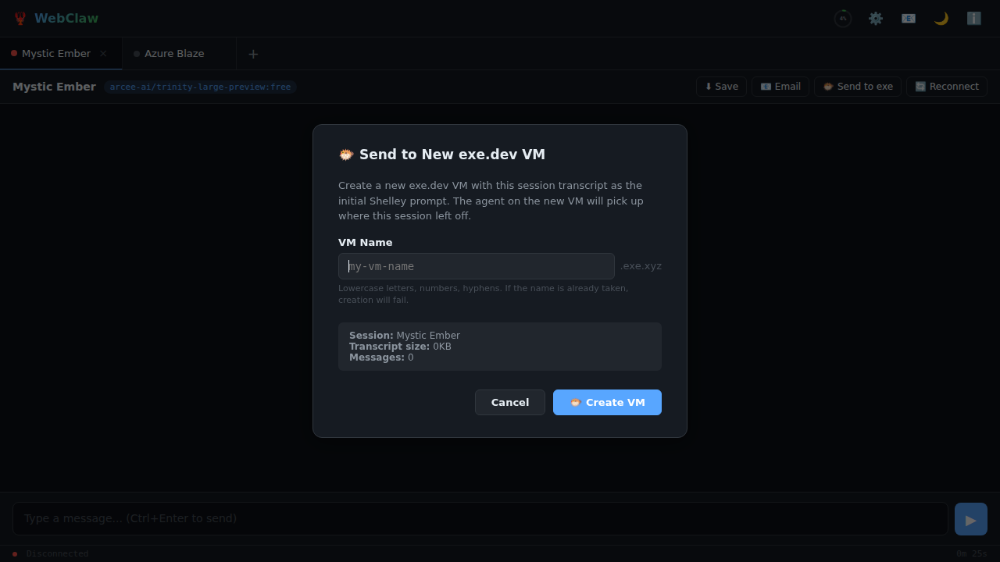

# 🦞 ExeClaw

**Ephemeral AI agent sessions in secure Firecracker microVMs.**

ExeClaw is a web application that launches isolated [nullclaw](https://github.com/boldcompany/nullclaw) AI coding agent sessions inside [Firecracker](https://firecracker-microvm.github.io/) micro-virtual-machines. Each session gets its own sandboxed Linux VM with full network access. Built to run on [exe.dev](https://exe.dev).



## ✨ Features

- **🔒 Sandboxed sessions** — Each agent runs in its own Firecracker microVM with a fresh Ubuntu 24.04 rootfs. Full isolation from the host and other sessions.
- **⚡ Fast boot** — VMs start in ~3 seconds with copy-on-write rootfs overlays.
- **🌐 Multi-provider** — Connect to OpenRouter, Anthropic, or OpenAI. Bring your own API key.
- **📱 Tabbed sessions** — Run multiple agent sessions simultaneously in browser tabs.
- **📡 Real-time streaming** — Server-Sent Events (SSE) stream agent output as it’s produced.
- **🧠 Agent working indicator** — Shelley-inspired letter-by-letter animated text shows when the agent is thinking.
- **📊 System memory gauge** — Live memory usage in the topbar. >90% pressure blocks new sessions.
- **⚙️ Configurable idle timeout** — Sessions auto-terminate after inactivity (default 72h, configurable 5 min–7 days).
- **📧 Email transcripts** — Send session conversations via email (on exe.dev).
- **🐡 Send to exe.dev VM** — Fork a session into a new exe.dev VM with the transcript as a Shelley prompt.
- **🎨 Rich rendering** — Markdown, JSON syntax highlighting, unified diff coloring, code blocks with copy buttons.
- **🌙 Dark/light theme** — Toggle with one click.
- **💾 Download & save** — Copy messages, download individual messages or full conversations as Markdown.

## 📸 Screenshots

<table>
<tr>
<td><br/><em>Session configuration</em></td>
<td><br/><em>Agent chat with JSON rendering</em></td>
</tr>
<tr>
<td><br/><em>Settings with idle timeout & exe.dev token</em></td>
<td><br/><em>Send session to new exe.dev VM</em></td>
</tr>
</table>

## 🏗️ Architecture

```
┌─────────────────┐     SSE Stream      ┌──────────────────┐
│   Browser SPA   │ ──────────────▶ │  Go HTTP Server  │
│  (Vanilla JS)   │     REST API     │   (stdlib only)  │
└─────────────────┘                  └────────┬─────────┘
                                           │
                              ┌─────────┴──────────┐
                              │  Firecracker VMs     │
                              │                      │
                              │ ┌─────────────────┐ │
                              │ │ Ubuntu 24.04 VM  │ │
                              │ │   nullclaw agent │ │
                              │ │   TAP networking │ │
                              │ └─────────────────┘ │
                              │ ┌─────────────────┐ │
                              │ │  Session 2 ...   │ │
                              │ └─────────────────┘ │
                              └──────────────────────┘
```

**Key design decisions:**

- **Zero external Go dependencies** — The entire backend is pure Go stdlib. No web frameworks, no ORMs, no dependency tree.
- **Single-file SPA** — The frontend is one `index.html` with inline CSS and JS. No build step, no npm, no bundler.
- **Copy-on-write rootfs** — Each VM gets a `cp --reflink=auto` copy of the base rootfs, so disk usage stays minimal.
- **Serial console parsing** — Communication with VMs happens over the Firecracker serial console (no SSH, no extra network services).
- **TAP networking** — Each VM gets its own TAP device with NAT for outbound internet access.

## 🛠️ Tech Stack

| Component | Technology |
|-----------|------------|
| Backend | Go (stdlib only, ~2400 lines) |
| Frontend | Vanilla JS SPA (~2800 lines, single file) |
| VM Runtime | Firecracker microVMs |
| Guest OS | Ubuntu 24.04 (ext4 rootfs) |
| Guest Kernel | Linux 6.1.128 |
| AI Agent | nullclaw |
| Streaming | Server-Sent Events (SSE) |
| Networking | TAP devices + iptables NAT |
| Markdown | marked.js + DOMPurify |
| Platform | [exe.dev](https://exe.dev) |

## 🚀 Deployment on exe.dev

ExeClaw is designed to run on [exe.dev](https://exe.dev) VMs, which provide the KVM access and networking infrastructure needed for Firecracker.

### Prerequisites

- An [exe.dev](https://exe.dev) VM (provides KVM, TAP networking, email gateway)
- Go 1.21+ installed
- Firecracker binary at `/usr/local/bin/firecracker`
- A Linux kernel and rootfs with nullclaw pre-installed (see `vm-assets/`)

### Quick Start

```bash
# Clone the repo
git clone https://github.com/jgbrwn/execlaw.git
cd execlaw

# Build
go build -o execlaw .

# Set up VM assets (kernel + rootfs)
mkdir -p vm-assets
# Place vmlinux kernel and rootfs.ext4 in vm-assets/

# Run directly
./execlaw

# Or install as a systemd service
sudo cp execlaw.service /etc/systemd/system/
sudo systemctl daemon-reload
sudo systemctl enable --now execlaw
```

The server listens on `:8000` by default. On exe.dev, it’s accessible at `https://VMNAME.exe.xyz:8000/`.

### Configuration

All configuration is via constants in `main.go`:

| Constant | Default | Description |
|----------|---------|-------------|
| `maxSessions` | 10 | Maximum concurrent VM sessions |
| `defaultSessionTimeoutMin` | 4320 (72h) | Default idle timeout in minutes |
| `listenAddr` | `:8000` | HTTP listen address |
| `vcpuCount` | 2 | vCPUs per VM |
| `memSizeMiB` | 1024 | RAM per VM in MiB |

### VM Assets

The `vm-assets/` directory needs:

- **`vmlinux`** — Uncompressed Linux kernel (6.1.x recommended)
- **`rootfs.ext4`** — ext4 filesystem image with Ubuntu 24.04 and nullclaw installed

The rootfs is not included in this repository due to size (~2GB). See the [rootfs setup guide](docs/rootfs-setup.md) for instructions on building your own.

## 📁 Project Structure

```
execlaw/
├── main.go              # Go backend (~2400 lines, pure stdlib)
├── go.mod               # Go module (zero dependencies)
├── static/
│   └── index.html       # Single-file SPA (~2800 lines)
├── vm-assets/
│   ├── vmlinux          # Linux kernel (not in repo)
│   └── rootfs.ext4      # Root filesystem (not in repo)
├── execlaw.service      # systemd unit file
├── docs/
│   └── screenshots/     # UI screenshots
├── LICENSE              # MIT
├── NOTICE               # Third-party attributions
└── README.md
```

## 🔌 API Endpoints

| Method | Path | Description |
|--------|------|-------------|
| `GET` | `/api/health` | Health check |
| `GET` | `/api/system` | System memory, load, session count |
| `GET` | `/api/platform` | exe.dev platform detection |
| `GET` | `/api/userinfo` | Current user info (from proxy headers) |
| `GET` | `/api/models/:provider` | List available models |
| `POST` | `/api/sessions` | Create a new VM session |
| `GET` | `/api/sessions/:id/status` | Session status |
| `GET` | `/api/sessions/:id/stream` | SSE event stream |
| `POST` | `/api/sessions/:id/input` | Send user message |
| `POST` | `/api/sessions/:id/email` | Email conversation |
| `DELETE` | `/api/sessions/:id` | Terminate session |
| `POST` | `/api/exedev/new` | Create new exe.dev VM with session |

### SSE Events

| Event | Description |
|-------|-------------|
| `message` | Agent text output |
| `tool_call` | Agent invoked a tool |
| `tool_result` | Tool execution result |
| `thinking` | Agent thinking/reasoning block |
| `status` | Session state change |
| `agent_busy` | Agent started working |
| `agent_idle` | Agent finished (3s idle timeout) |
| `exit` | Session ended |
| `error_event` | Error occurred |

## 💡 Inspiration

- [**Shelley**](https://github.com/boldsoftware/shelley) — exe.dev’s coding agent. ExeClaw’s agent-working animation (letter-by-letter bold cycling) is directly inspired by Shelley’s `AnimatedWorkingStatus` component.
- [**exe.dev**](https://exe.dev) — The VM platform. ExeClaw leverages exe.dev’s proxy authentication, email gateway, and HTTPS API for the “Send to VM” feature.
- [**Firecracker**](https://firecracker-microvm.github.io/) — Amazon’s lightweight VMM. Provides the sub-second boot times and strong isolation that make ephemeral sessions practical.

## 📜 License

[MIT](LICENSE) — see [NOTICE](NOTICE) for third-party attributions.
